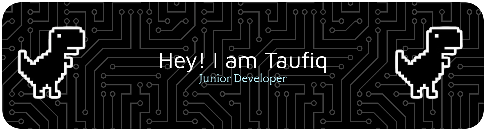

# Halo, Saya Taufiqurrahman

---

  
  
  
  
  
  
  
  
  

---

  
  
  
  
  
  

---

  <picture>
    <source media="(prefers-color-scheme: dark)" srcset="https://raw.githubusercontent.com/Taufiqurrahman10/Taufiqurrahman10/output/pacman-contribution-graph-dark.svg">
    <source media="(prefers-color-scheme: light)" srcset="https://raw.githubusercontent.com/Taufiqurrahman10/Taufiqurrahman10/output/pacman-contribution-graph.svg">
    
  </picture>

