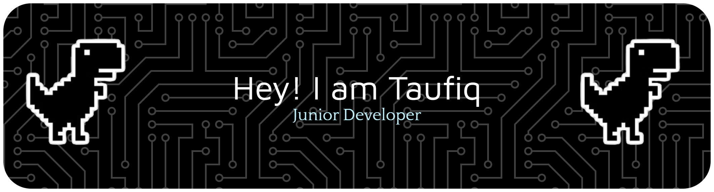

<div align="center">
  

  <br />

  <a href="https://git.io/typing-svg">
    
  </a>

  <br />

  <a href="https://github.com/Taufiqurrahman10?tab=followers">
    
  </a>
  <a href="https://github.com/Taufiqurrahman10?tab=repositories">
    
  </a>
</div>

## 👨‍💻 Tentang saya

Halo! Saya **Taufiqurrahman**, seorang junior developer yang senang mengubah ide menjadi aplikasi yang bermanfaat. Saat ini saya terus mengeksplorasi pengembangan web, aplikasi mobile, backend service, dan deployment.

```go
package main

var taufiq = Developer{
    Focus:    []string{"Web Development", "Mobile Apps", "Backend Services"},
    Learning: "Build, ship, learn, repeat",
    FunFact:  "Bug adalah teka-teki yang belum selesai.",
}
```

- 🔭 Sedang membangun dan menyempurnakan berbagai proyek personal
- 🌱 Terus belajar teknologi baru melalui praktik langsung
- 💬 Terbuka untuk berdiskusi, berkolaborasi, dan bertukar ide
- ⚡ Suka membuat solusi yang sederhana untuk masalah yang nyata

## 🧰 Teknologi & tools

<div align="center">
  
</div>

## 🚀 Proyek pilihan

| Proyek | Ringkasan | Teknologi |
| :--- | :--- | :---: |
| [📚 **Aplikasi Perpustakaan**](https://github.com/Taufiqurrahman10/uas-topik-khusus-perpustakaan) | Proyek UAS Topik Khusus dengan proses deployment menggunakan Docker. | `Vue` `Docker` |
| [👥 **Flutter Kepegawaian**](https://github.com/Taufiqurrahman10/flutter_kepegawaian) | Eksplorasi aplikasi mobile untuk pengelolaan data kepegawaian. | `Dart` `Flutter` |
| [🐱 **Dashboard Cat Disease**](https://github.com/Taufiqurrahman10/dashboard_cat_disease) | Dashboard web untuk pengelolaan informasi penyakit pada kucing. | `Laravel` `Blade` |
| [🔔 **Notification Publisher**](https://github.com/Taufiqurrahman10/notification-publisher) | Eksperimen backend service untuk alur publikasi notifikasi. | `Go` |

## 📊 Aktivitas GitHub

<div align="center">
  
  
  
</div>

## 🤝 Mari terhubung

<div align="center">
  <p>Tertarik dengan salah satu proyek saya? Silakan lihat repository-nya, buka issue, atau ajak saya berdiskusi.</p>
  <a href="https://github.com/Taufiqurrahman10">
    
  </a>
</div>

<br />

<div align="center">
  
  <sub>Terima kasih sudah berkunjung. Jangan lupa tinggalkan ⭐ jika ada proyek yang kamu suka!</sub>
</div>
